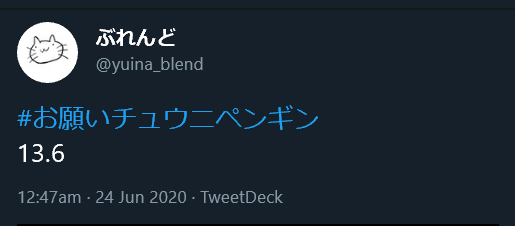
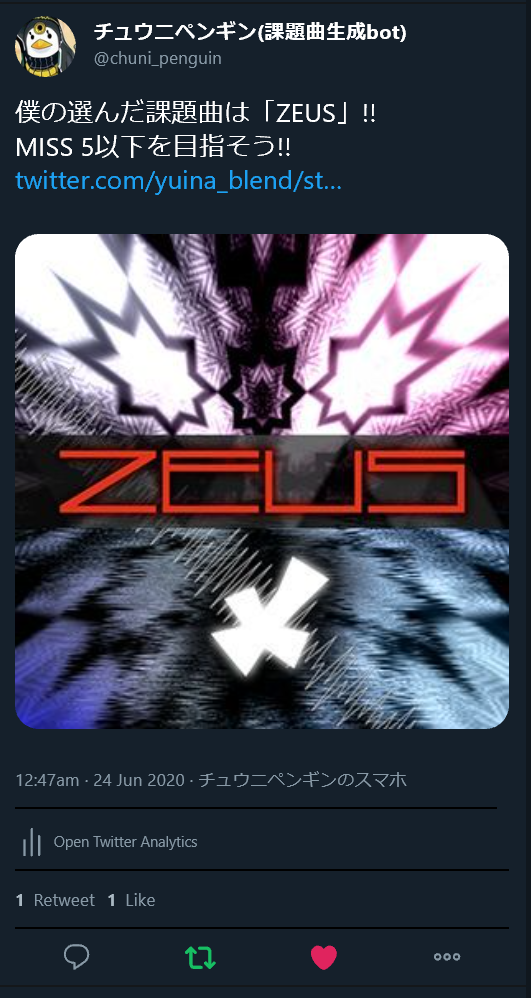

# chuni-penguin

# 概要

Twitter上で動くbotです。CHUNITHMの課題曲出してくれます。

ID : [@chuni_penguin](https://twitter.com/chuni_penguin) 

## 使い方

**#お願いチュウニペンギン**と**楽曲レベル**（現状で指定できるのはこれだけ）を含めてツイートすると**引用RT**で課題が返ってきます。

## 注意点

- 別にフォローしなくても使えます。（でもフォローしてくれるとうれしい）
- 現在譜面定数12.4まで対応してます。随時追加予定
- 対応していない難易度が指定されるとランダムで選曲します。
- :poop:全角数字はやめろ:poop:

## 今後について

ジャンルの指定、コースモードも作るかも。自動フォロバは近いうちに作ります。

気まぐれなので期待はしないで